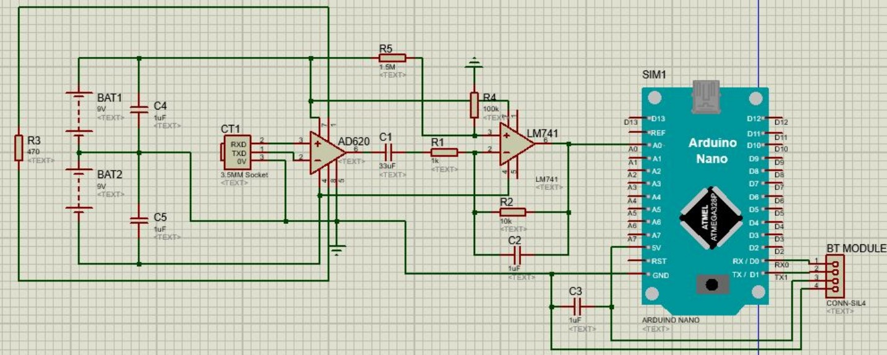
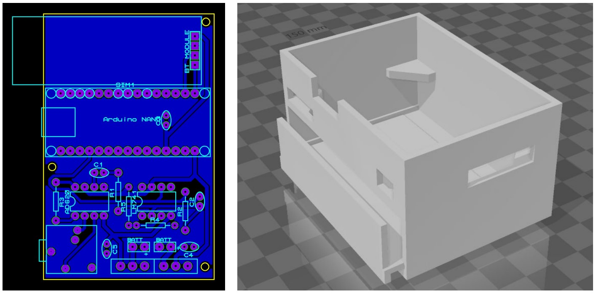
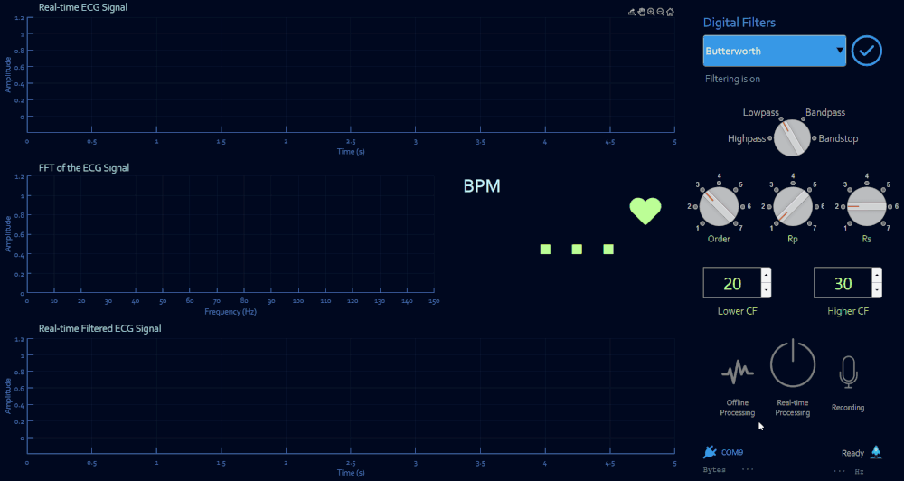

# ECG Signal Acquisition and Data Processing Circuit and Software Development

## Description

The aim of the project is to acquire ECG signals from the human body in real-time and to obtain average BPM value, R-R tachogram and power spectral density (PSD) graphs through peak detection. ECG signals, which are acquired by means of electrodes and leads, are preprocessed in a circuit including an instrumentation amplifier, a capacitor for linearization purposes and an active low-pass filter. After preprocessing, these signals are transmitted to an analog-to-digital converter communicating with a computer via a Bluetooth module. In the software, these signals can be monitored in real-time along with the FFT (Fast Fourier Transform). The software also offers some filtering types that can be implemented on these signals in real-time. Real-time signals can be recorded for post-processing. Post-processing encompasses calculation of average BPM, R-R tachogram and power spectral density analysis through peak detection.
  

## Circuit | Development & Design

ECG signals come to the circuit through [electrodes](https://www.google.com/search?q=disposable+ecg+electrodes&safe=strict&hl=en&source=lnms&tbm=isch) and [leads](https://www.google.com/search?q=ecg+lead+wires&tbm=isch). In this application, **the three-electrode configuration** is used. The circuit is supplied by two 9V batteries. To eliminate artifacts, ECG signals pass through an instrumentation amplifier (AD620) for common-mode rejection and then a capacitor acting as a high-pass filter to eliminate baseline wandering and they subsequently pass through an active low-pass filter which is a first-order filter with the cutoff frequency of 13 Hz. In the last stage, these signals enter an analog pin of Arduino. Arduino is used as an analog-to-digital converter sampling at 500 Hz and communicating with a computer via the Bluetooth module (HC-06).

### Components
- [Electrodes](https://www.google.com/search?q=disposable+ecg+electrodes&safe=strict&hl=en&source=lnms&tbm=isch) and [leads](https://www.google.com/search?q=ecg+lead+wires&tbm=isch)
- [3.5 mm TRS socket](https://www.google.com/search?q=3.5mm+female+audio+jack+for+pcb&safe=strict&hl=en&source=lnms&tbm=isch)
- AD620 Instrumentation Amplifier
- LM741 Operational Amplifier
- Arduino® Nano®
- HC-06 Bluetooth Module
- Capacitors and Resistors

### Schematic Design

### PCB & Case Designs

  

## Software | Setup & Capabilities

The software has been developed by using MATLAB's App Designer. The software has been originally developed for Windows OS.

### Setup

If you will be using the HC-06 Bluetooth module, you need to change the baud rate of the module to 115200 bits per second. You can follow [this documentation](http://www.martyncurrey.com/arduino-and-hc-06-zs-040/).

<ul>
  <li><h4>If you have already MATLAB installed:</h4></li>

  Just check if you have the signal processing toolbox installed. If you have, you can directly run the [*ECG-Analysis.exe*](Software/MATLAB-Executable-App).

  <li><h4>If you do not want to install MATLAB:</h4></li>
  
  To be able to run the executable file, you need to install the [MATLAB runtime](Software/MATLAB-Executable-App/MATLAB-Package).
</ul>  

### Real-time Processing and Data Recording

### Offline Processing and HRV Analysis

### Peak Detection Algorithm 

### Capabilities
#### Real-time:
- ECG monitoring
- FFT and filtering
- Monitoring the response of the selected filter
- BPM monitoring
- Monitoring available bytes in the input buffer
- Monitoring the sampling frequency
- Data recording

#### Offline:
- Loading ECG records with trimming options
- ECG monitoring
- FFT and filtering
- Monitoring the response of the selected filter
- Average BPM monitoring
- Peak detection
- R-R tachogram
- PSD analysis of R-R tachogram
  

<h2>⚠️ Disclaimer</h2>

***Neither the circuit nor the software described above can be used in medical diagnosis or the treatment of any conditions. Otherwise, we cannot be held responsible for any harm or damages.***
